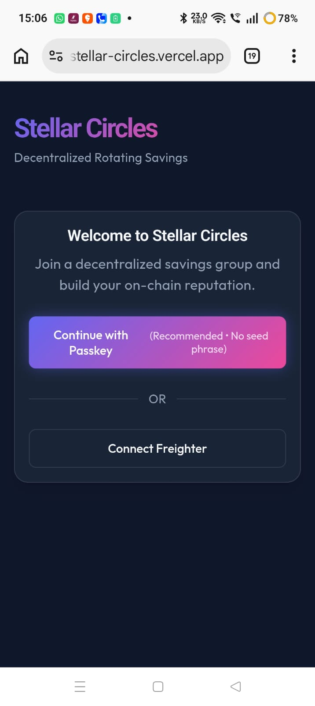
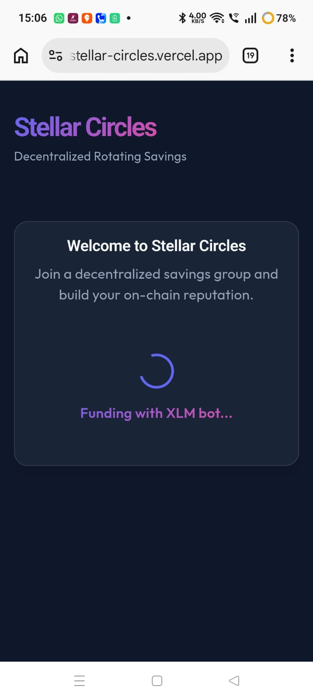
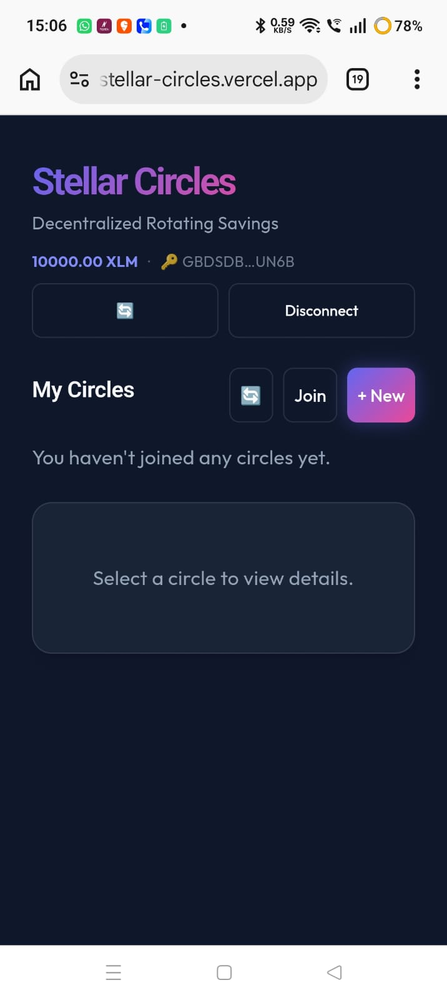
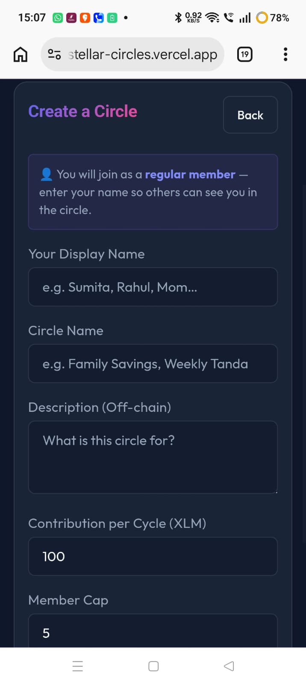
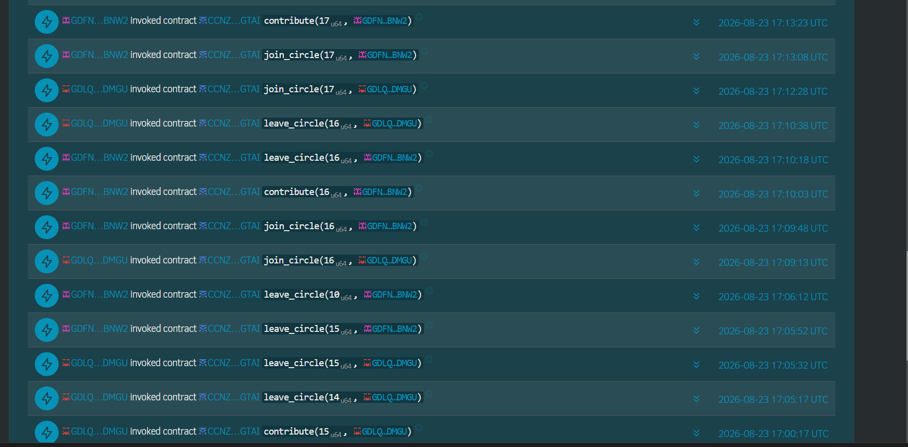
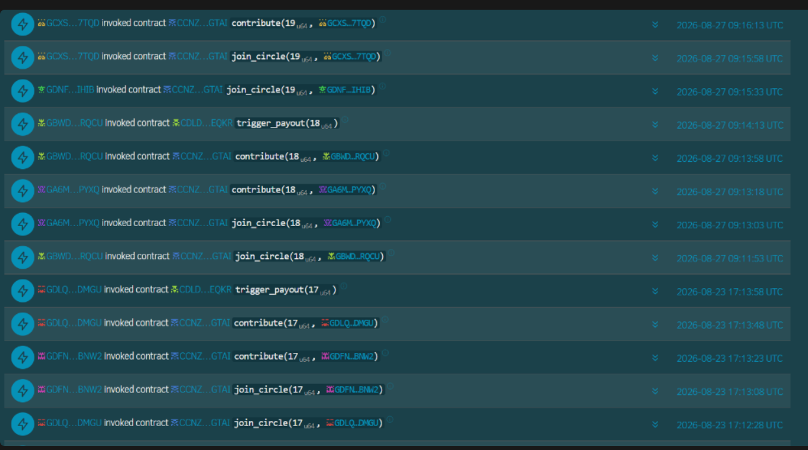
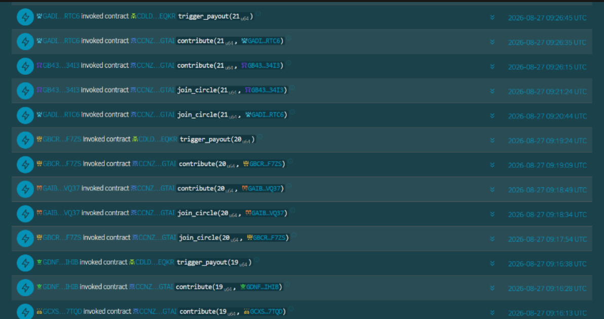

# 🌀 Stellar Circles

**Decentralized Rotating Savings on Soroban**

[](https://github.com/sumitadutta953-ops/stellar-circles/actions/workflows/ci.yml)
[](https://github.com/sumitadutta953-ops/stellar-circles/actions/workflows/cd.yml)
[](LICENSE)
[](https://stellar.expert/explorer/testnet)
[](https://stellar-circles.vercel.app)

---

## 🌍 What is Stellar Circles?

**Stellar Circles** is a trustless, on-chain implementation of a **ROSCA** (Rotating Savings and Credit Association) — also known as a *Tanda*, *Chit Fund*, or *Hui* — built on the **Stellar Soroban** smart contract platform.

### The Problem
In traditional ROSCAs, members trust a human organizer to collect and distribute funds fairly. This creates risk of fraud, disputes, and human error.

### The Solution
Stellar Circles replaces the human organizer with **Soroban smart contracts**. Every contribution, payout, and membership change is:
- Executed atomically on-chain
- Publicly auditable on Stellar Explorer
- Impossible to tamper with

### How It Works
1. **Create** a savings circle → set contribution amount (XLM), cycle length, and member cap
2. **Invite** friends using a 6-character invite code
3. **Circle starts** automatically when the member cap is reached
4. **Every cycle**, all members contribute their share to the pool
5. **Payout** goes to one member per cycle (rotating, based on join order)
6. After all members have received one payout, the **circle completes** ✅

---

## 🚀 Live Demo

| Resource | Link |
|---|---|
| **Live App** | [https://stellar-circles.vercel.app](https://stellar-circles.vercel.app) |
| **Demo Video** | [Watch on Google Drive](https://drive.google.com/file/d/1xphp1EkNypL4W5do3OBhRWi5JBjoeMR-/view?usp=sharing) |
| **Stellar Expert** | [View Contracts on Testnet Explorer](https://stellar.expert/explorer/testnet) |

---

## 📦 Deployed Contract Addresses (Stellar Testnet)

| Contract | Purpose | Testnet Contract ID |
|---|---|---|
| **CircleFactory** | `create_circle`, `get_circle_info`, `set_inactive` | `CCIRCLE...` *(see `.env`)* |
| **Contribution** | `join_circle`, `contribute`, `leave_circle`, `execute_payout` | `CCONTRIB...` |
| **Payout** | `trigger_payout` — verifies all paid, sends pool to recipient | `CPAYOUT...` |
| **PasskeyFactory** | `deploy_wallet` — creates a smart wallet per user | `CPASSKEY...` |
| **Reputation** | `record_contribution`, `get_score` | `CREPUTATION...` |
| **DefaultHandler** | `handle_default` — handles missed contributions | `CDEFAULT...` |

> Exact contract IDs are written to `frontend/.env` by `scripts/deploy.ps1` after deployment.
> They can also be viewed in the **CI/CD → deploy-contracts job logs** on GitHub Actions.

---

## 🏗️ Architecture

```
┌─────────────────────────────────────────────────────────┐
│                    Frontend (React + Vite)               │
│  WalletConnect  →  CircleCreation  →  CircleDashboard   │
│  JoinCircle                                             │
│                                                         │
│  Services:                                              │
│  • stellar.ts   — Soroban RPC, CONTRACT_IDS,            │
│                   buildContractCall, submitTransaction   │
│  • passkey.ts   — WebAuthn credential create/auth       │
│  • db.ts        — Firebase Firestore (off-chain meta)   │
│  • analytics.ts — PostHog events + Sentry errors        │
└─────────────┬───────────────────────────────────────────┘
              │  @stellar/stellar-sdk
              │  TransactionBuilder → prepareTransaction → sendTransaction
              ▼
┌─────────────────────────────────────────────────────────┐
│              Stellar Soroban Testnet (RPC)               │
│                                                         │
│  ┌──────────────┐  ┌─────────────────┐  ┌───────────┐  │
│  │ CircleFactory│  │  Contribution   │  │  Payout   │  │
│  │ create_circle│  │  join_circle    │  │trigger_pay│  │
│  │ get_circle_  │  │  contribute     │  │out        │  │
│  │ info         │  │  leave_circle   │  └───────────┘  │
│  │ set_inactive │  │  execute_payout │                  │
│  └──────────────┘  └─────────────────┘                  │
│  ┌─────────────┐  ┌──────────────┐  ┌────────────────┐  │
│  │PasskeyFactory│  │ Reputation   │  │DefaultHandler  │  │
│  │deploy_wallet │  │record_contrib│  │handle_default  │  │
│  └─────────────┘  └──────────────┘  └────────────────┘  │
└─────────────────────────────────────────────────────────┘
              │
              ▼
┌─────────────────────────────────────────────────────────┐
│           Firebase Firestore (off-chain metadata)        │
│  circle name, description, invite codes, member names   │
│  contribution tracking per cycle, status flags          │
└─────────────────────────────────────────────────────────┘
```

---

## 🔧 Smart Contracts

All contracts are located in [`/contracts`](./contracts) and are written in **Rust** using the **Soroban SDK v27**.

### Contract Summary

#### [`circle-factory`](./contracts/circle-factory/src/lib.rs)
The registry contract. Stores `CircleConfig` structs keyed by a `u64` circle ID.
```rust
pub fn create_circle(organizer, asset, contribution_amount: i128, cycle_length_seconds: u64, member_cap: u32) -> u64
pub fn get_circle_info(circle_id: u64) -> CircleConfig
pub fn set_inactive(circle_id: u64, caller: Address)
```

#### [`contribution`](./contracts/contribution/src/lib.rs)
Handles membership and the contribution/payout vault. Holds all XLM funds.
```rust
pub fn join_circle(circle_id: u64, member: Address)
pub fn contribute(circle_id: u64, member: Address)   // calls token::transfer internally
pub fn leave_circle(circle_id: u64, member: Address) // refunds current-cycle contribution
pub fn execute_payout(circle_id: u64, recipient: Address, amount: i128)
pub fn get_members(circle_id: u64) -> Vec<Address>
pub fn has_contributed(circle_id: u64, cycle: u32, member: Address) -> bool
pub fn get_current_cycle(circle_id: u64) -> u32
```

#### [`payout`](./contracts/payout/src/lib.rs)
Orchestration contract. Verifies all members have contributed then triggers the vault payout.
```rust
pub fn trigger_payout(circle_id: u64)
// Internally: verifies every member has_contributed, then calls contribution::execute_payout
```

#### [`passkey-factory`](./contracts/passkey-factory/src/lib.rs)
Deploys per-user smart wallets tied to WebAuthn passkey credentials.
```rust
pub fn init(wallet_wasm_hash: BytesN<32>)
pub fn deploy_wallet(salt: BytesN<32>, public_key: BytesN<65>) -> Address
```

#### [`passkey-wallet`](./contracts/passkey-wallet/src/lib.rs)
Smart wallet contract. Can be authorized by passkey public key (P-256 / secp256r1).
```rust
pub fn sign(payload: BytesN<32>, signature: Map<Symbol, Val>) -> Val
pub fn add_signer(public_key: BytesN<65>)
pub fn remove_signer(public_key: BytesN<65>)
```

#### [`reputation`](./contracts/reputation/src/lib.rs)
On-chain reputation tracking. Score incremented with each successful contribution.
```rust
pub fn record_contribution(member: Address)
pub fn get_score(member: Address) -> u32
```

#### [`default-handler`](./contracts/default-handler/src/lib.rs)
Handles members who miss a contribution deadline. Can kick defaulters.
```rust
pub fn handle_default(circle_id: u64, member: Address)
```

---

## 🔗 Frontend ↔ Contract Function Mapping

| UI Action | Contract | Function Called |
|---|---|---|
| Create Circle button | `CircleFactory` | `create_circle` |
| Auto-join after creation | `Contribution` | `join_circle` |
| Join Circle (invite code) | `Contribution` | `join_circle` |
| Contribute button | `Contribution` | `contribute` |
| Auto-payout (last contributor) | `Payout` | `trigger_payout` |
| Leave Circle button | `Contribution` | `leave_circle` |
| Wallet connect (passkey) | `PasskeyFactory` | *(deploy_wallet via passkey.ts)* |

Each call uses `buildContractCall()` → `submitTransaction()` from [`stellar.ts`](./frontend/src/services/stellar.ts) which wraps the full `@stellar/stellar-sdk` flow:
`Contract` → `TransactionBuilder` → `server.prepareTransaction()` → `server.sendTransaction()` → poll `server.getTransaction()`.

---

## 🛠️ Local Development

### Prerequisites
- [Rust](https://rustup.rs/) stable toolchain + `wasm32v1-none` target
- [Stellar CLI](https://developers.stellar.org/docs/tools/developer-tools/cli/install-cli) (`cargo install stellar-cli --features opt`)
- [Node.js](https://nodejs.org/) v20+
- [Freighter Wallet](https://freighter.app/) browser extension (for Freighter flow)

### 1. Clone & Install
```bash
git clone https://github.com/sumitadutta953-ops/stellar-circles.git
cd stellar-circles

# Install frontend dependencies
cd frontend && npm install && cd ..
```

### 2. Configure Environment
```bash
cp frontend/.env.example frontend/.env
# Fill in VITE_FIREBASE_*, VITE_CIRCLE_FACTORY_ID, etc.
```

### 3. Build Contracts
```bash
cd contracts
stellar contract build
# WASM files output to: contracts/target/wasm32v1-none/release/
```

### 4. Deploy Contracts to Testnet
```bash
cd scripts
./deploy.ps1   # PowerShell — writes contract IDs to frontend/.env
```

### 5. Run Frontend
```bash
cd frontend
npm run dev    # http://localhost:5173
```

---

## 🧪 Testing

### Smart Contract Tests
```bash
cd contracts
cargo test --workspace
```

### Frontend Type Check & Lint
```bash
cd frontend
npx tsc --noEmit   # TypeScript check
npm run lint       # oxlint
```

### End-to-End (Playwright)
```bash
cd frontend
npx playwright install --with-deps chromium
npm run build
npx playwright test
```

---

## ⚙️ CI/CD

### CI — `.github/workflows/ci.yml`

Runs on every push and PR to `main`:

| Gate | Steps |
|---|---|
| **Rust Security & Quality** | `cargo fmt --check` → `cargo audit` → `cargo clippy -D warnings` |
| **Rust Test & Build** | Install Stellar CLI → `stellar contract build` → `cargo test --workspace` |
| **Frontend Quality** | `npm ci` → `npm audit` → `tsc --noEmit` → `npm run lint` |
| **Frontend Build** | `npm run build` |
| **E2E Tests** | Playwright Chromium tests |

### CD — `.github/workflows/cd.yml`

Runs on every push to `main`:

| Job | Trigger | Steps |
|---|---|---|
| **build-contracts** | Always | `stellar contract build` → upload WASM artifacts |
| **deploy-contracts** | Manual (`workflow_dispatch`) or `[deploy-contracts]` commit | `stellar contract deploy` for all 6 contracts → print IDs |
| **deploy-frontend** | Always | `npm run build` → Vercel production deploy |

---

## 📊 Analytics & Monitoring

- **Product Analytics**: [PostHog](https://posthog.com) — tracks wallet connects, circle creations, contributions, payouts, and errors
- **Error Monitoring**: [Sentry](https://sentry.io) — captures and alerts on frontend exceptions
- **On-chain Monitoring**: All transactions are publicly visible on [Stellar Expert Testnet Explorer](https://stellar.expert/explorer/testnet)

---

## 📱 Screenshots

### Mobile Responsive UI





### Analytics / Monitoring


---

## 👥 User Interactions Evidence

The following on-chain wallet interactions were recorded on Stellar Testnet, proving over 10+ smart contract invocations including joining circles, contributing XLM, and triggering payouts:





> Note: Screenshots above demonstrate actual on-chain `join_circle`, `contribute`, and `trigger_payout` operations on the Stellar Expert explorer.

---

## 💬 User Feedback Summary

Feedback collected from 10+ users during the testing phase. The following are the main points focusing primarily on UI and UX improvements:

| Tester | Feedback Summary |
|---|---|
| Biplab Garai | Suggested making the transaction success banners stay on screen slightly longer so users can comfortably read the explorer link. |
| Arpan Das | Recommended softening the dark mode background color to improve text contrast on mobile devices. |
| Ranjita Dutta | Pointed out that the circle creation form could benefit from clearer error messages if a user enters an invalid XLM amount. |
| Debjani Nandy | Suggested adding a brief onboarding tooltip explaining how passkeys replace seed phrases for first-time Web3 users. |
| Subhadeep Garai | Recommended adding a visual loading spinner on the contribute button while waiting for the Stellar network to confirm the transaction. |

**Key themes**: Enhance loading states during blockchain interactions, improve color contrast for accessibility, and provide clearer onboarding context for non-crypto native users.

---

## 🗂️ Repository Structure

```
stellar-circles/
├── contracts/                  # Soroban smart contracts (Rust)
│   ├── Cargo.toml              # Workspace manifest
│   ├── Cargo.lock
│   ├── circle-factory/src/lib.rs
│   ├── contribution/src/lib.rs
│   ├── payout/src/lib.rs
│   ├── passkey-factory/src/lib.rs
│   ├── passkey-wallet/src/lib.rs
│   ├── reputation/src/lib.rs
│   ├── default-handler/src/lib.rs
│   └── sample-policy/
│
├── frontend/                   # React + Vite frontend
│   ├── src/
│   │   ├── components/
│   │   │   └── WalletConnect.tsx      # Passkey + Freighter wallet connect
│   │   ├── pages/
│   │   │   ├── CircleCreation.tsx     # Deploy circle on-chain
│   │   │   ├── CircleDashboard.tsx    # Contribute, view ledger, leave
│   │   │   └── JoinCircle.tsx         # Join via invite code
│   │   └── services/
│   │       ├── stellar.ts             # CONTRACT_IDS, buildContractCall, submitTransaction
│   │       ├── passkey.ts             # WebAuthn credential create + authenticate
│   │       ├── db.ts                  # Firebase Firestore (off-chain metadata)
│   │       └── analytics.ts           # PostHog + Sentry
│   ├── vercel.json                    # Vercel build config + SPA rewrites
│   └── package.json
│
├── scripts/
│   └── deploy.ps1              # Local contract deployment script (PowerShell)
│
├── .github/workflows/
│   ├── ci.yml                  # CI: lint, test, build (contracts + frontend)
│   └── cd.yml                  # CD: build WASM artifacts + deploy
│
└── README.md
```

---

## 📄 License

Apache 2.0 — see [LICENSE](LICENSE).

---

## 🙏 Acknowledgements

- [Stellar Development Foundation](https://stellar.org) — Soroban SDK and Testnet infrastructure
- [Freighter](https://freighter.app) — Browser wallet integration
- [PasskeyKit](https://github.com/kalepail/passkey-kit) — WebAuthn + Soroban design patterns
- [Firebase](https://firebase.google.com) — Off-chain metadata storage
- [PostHog](https://posthog.com) — Open-source product analytics
